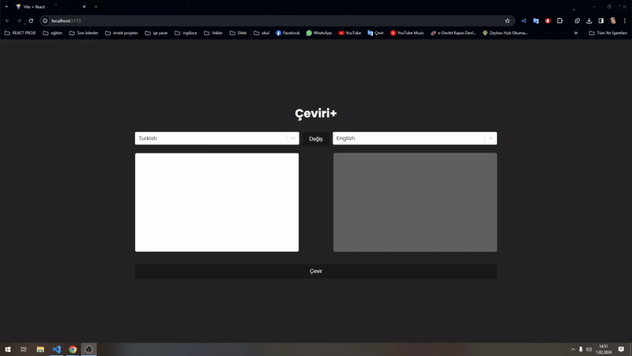

# Çeviri Uygulaması

Bu proje, metin çevirisi yapabilen basit bir React uygulamasıdır. Kullanıcılar, farklı diller arasında metin çevirisi yapabilirler.

## Ekran Görüntüsü

## Kullanılan Teknolojiler

- React: Web kullanıcı arayüzleri oluşturmak için kullanıldı.
- Redux Toolkit: React uygulaması için durum yönetimi sağlamak için kullanıldı.
- React-Select: Güzel ve özelleştirilebilir dil seçenekleri için kullanıldı.
- Axios: HTTP istekleri yapmak için kullanıldı.

## Özellikler

- **Dil Seçimi:** Kaynak ve hedef diller arasında seçim yapabilme özelliği.
- **Metin Çevirisi:** Kullanıcılar, çevrilmek istenen metni girebilir ve çeviri yapabilir.
- **Yüklenme Göstergesi:** Dil seçenekleri veya çeviri işlemi sırasında yüklenme göstergesi.

